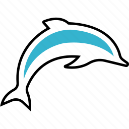

# M. E. GALINDO     

# Nombre del proyecto - Stats Preview Card Component     

- Stats Preview Card Component, Este proyecto es parte del desafío:
#100daysofprojects promovido por [Frontend Club](https://www.facebook.com/frontendclubfb).

# Tabla de contenidos 📋

  - [Descripcion](#descripcion)
  - [Realizar](#Realizar)
  - [Recursos](#Recursos)
  - [Tecnologias](#Tecnologias)
  - [Subir Proyecto](#Subir-Proyecto)
  - [Referencias](#Referencias)
  - [Contacto](#Contacto)

## Descripcion 📄

 Nuestra misión será crear un componente orden de pedido, usando HTML y CSS; y lograr que se parezca lo más posible al diseño.

## Realizar 🚀

### Los usuarios deberían poder:
- Ver un diseño óptimo en pantallas grandes(1200px), medianas(768px) y pequeñas(375px).

### Importante:
- Agrega un icono favicon al proyecto.
- Agrega una URL fácil de recordar (ej. 09-order-summary-component).
- Agrega un título al proyecto (ej. Stats Preview Card Component - Frontend Club).
- Bonus: Agrega un archivo readme.md al proyecto.

## Recursos ⚙️

Lista de recursos para ayudarte a completar el reto.

[Clonar proyecto inicial](https://github.com/frontend-club/100daysofprojects)

:Visualizar diseño original  
[Opcion 01](https://frontend-club.hashnode.dev/?source=top_nav_blog_home) 
[Opcion 01](https://github.com/frontend-club/100DaysOfProjects/)

## Tecnologias 🛠️

1. HTML Semántico
2. Estilos CSS
3. Animaciones CSS
4. Metodología BEM
5. Responsively App

## Subir Proyecto 🔩

[subir proyecto](https://docs.google.com/forms/d/e/1FAIpQLScFcrCiH1UI3nuImB3LNF2cHGvRa6y7NhJ7E6i8FRqcS90FbA/viewform)

## Referencias 📖

Nuestro agradecimiento a las fuentes que hacen posible los recursos y nos inspiran a seguir compartiendo conocimiento.
- [W3Schools](https://www.w3schools.com/) 
- [UI Design Daily](https://www.uidesigndaily.com/)
- [Frontend Mentor](https://www.frontendmentor.io/)
- [Badges](https://github.com/Naereen/badges/blob/master/README.md)
El diseño de este proyecto es propiedad de: Frontend Mentor

## Contacto 📌

Medios de contacto.

- ☕  [LinkedIn](#) 
- 🎁  [Facebook](#) 
- 😊  [GitHub](#)    
- ❤️  [Correo](#) 

- Acerca de mi 

#### Actualmente me dedico a:

- Reforzar conocimientos sobre HTML, CSS3, BOOSTRAP, JAVASCRIPT, PHP.
- Aprender e investigar sobre CIBERSEGUIRDAD.
- Adquirir conocimientos sobre sistema operativo [LINUX.]()
